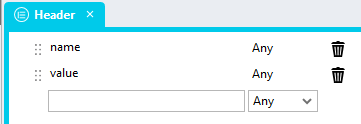

# Live Update

A repo that enables you to call a REST API using GET or POST at a specified interval to retreive data and update page controls. 

## A Cautionary Note
While this script ensures that only one call is active at one time, every time this script executes a REST call is made in the background. At high call frequencies or when calls return a large amount of data, a lot of traffic can be generated which may slow down the network for all users. API's that return a large amount of data might also impact the performance of the client browser and other applications on the client machine. Furthermore, depending on the amount or work the REST API performs to return a result, this script might also impact other operations on the hosting server. 

In order to mitigate negative impacts on users and networks as much as possible, it is advisable to:

1. Call the script with the lowest possible frequency
2. Retrieve as little data as possible from the API
3. Ensure that the REST API is able to handle the load being put on it by repeated calls

## Example uses
https://github.com/stadium-software/live-update/assets/2085324/14132dde-aeb0-4cf3-8055-dced6a6eb1f6

## GET Global Script Setup
1. Create a Global Script called "LiveConnector"
2. Add the following input parameters to the Global Script
   1. Callback
   2. Headers
   3. SecondsInterval
   4. Url
   5. Body
   6. Method
3. Drag a *JavaScript* action into the script
4. Add the Javascript below into the JavaScript code property (ignore the validation error message "Invalid script was detected")
```javascript
let scope = this;
let callback = ~.Parameters.Input.Callback;
if (!callback) {
    console.error("The 'callback' parameter is required");
    return false;
}
let url = ~.Parameters.Input.Url;
if (!url) {
    console.error("The 'url' parameter is required");
    return false;
}
let interval = ~.Parameters.Input.SecondsInterval;
if (!interval) interval = 5;
let body = ~.Parameters.Input.Body;
let headersParameter = ~.Parameters.Input.Headers;
let arrHeaders = [];
if (headersParameter) arrHeaders = headersParameter;
let headers = {};
let page = window.location.href;
let isRunning = false;
let addContentType = true;
for (let i = 0; i < arrHeaders.length; i++) {
  headers[arrHeaders[i].name] = arrHeaders[i].value;
  if (arrHeaders[i].name.toLowerCase() == "content-type") addContentType = false;
}
if (addContentType) headers["Content-Type"] = "application/json";
let method = ~.Parameters.Input.Method;
if (!method) method = "GET";
let requestOptions = {
    method: method,
    headers: headers,
    body: body
};
if (method.toLowerCase() != "post") {
    method = "GET";
    delete requestOptions.body;
}
setInterval(function () { 
  if ((page == window.location.href) && (!isRunning)) {
    isRunning = true;
    fetch(url, requestOptions)
      .then(async response => {
        const isJson = response.headers.get('content-type')?.includes('application/json');
        let data;
        if (isJson) {
          data = await response.json();
        } else {
          data = await response.text();
        }
        if (!response.ok) {
          const error = (data && data.message) || response.status;
          return Promise.reject(error);
        } else {
            await scope[callback](data);
            isRunning = false;
        }
      })
      .catch(error => {
        console.error(error);
        isRunning = false;
      });
  }
}, (interval * 1000));
```

## Headers Type Setup
1. Create a new type called "Header"
2. Add the following properties to the type
   1. name (Any)
   2. value (Any)



## Callback Script Setup
The Callback script is the script that the "LiveConnector" script calls whenever it has received data back from the REST API. This is the script where you need to update the page controls to show the updated data. 

1. Create a new script under the page you wish to keep updated (you can name this script anything you like e.g. callback)
2. Add an input parameter below to the script (you can name this parameter anything you like e.g. Data)

## Calling the global script
1. Drag the "LiveConnector" script into the Page.Load or another event listener of your choice
2. Complete the input parameters for the Global Script
   1. Callback (required): The name of the callback script you created under the page (e.g. callback)
   2. Headers (optional): A *List* of type "Header" containing any headers you wish to pass to the script (e.g. authentication parameters)
   3. SecondsInterval (optional / default: 5): The minimum number of seconds the script will wait before it fires again
   4. Url (required): The URL where the REST API is located
   5. Body (optional): Any body you wish to send to the REST API when using POST
   6. Method (optional / default "GET")

## Consuming the returned data
The script assigns the returned data to the callback script input parameter. The best method for using the data returned by the API is to create a type of the data and populate an instance of that type in the callback script. This simplifies the identification of various parts of the data and makes assignment of the returned data to controls easier. 
